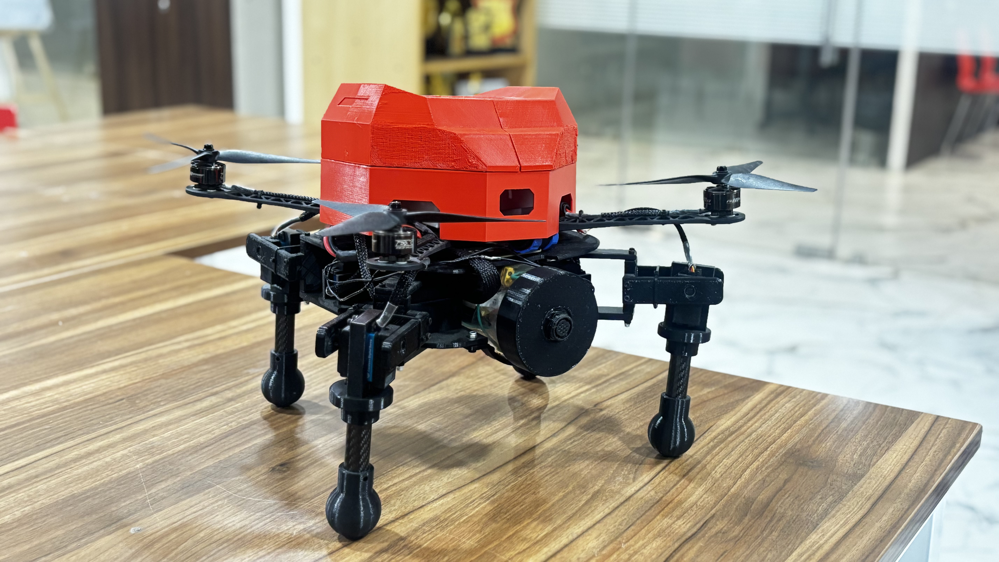
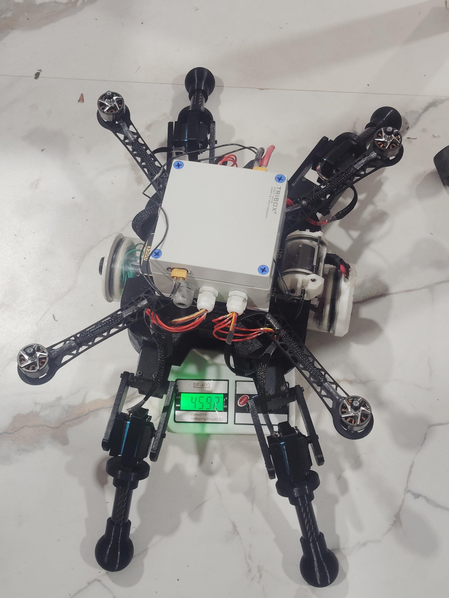

# NDVI Drone 🌾🛸

**Precision-agriculture drone system for real-time vegetation health monitoring using NDVI (Normalized Difference Vegetation Index) analysis.**

Built around a Pixhawk Cube Orange flight controller, Raspberry Pi 5 companion computer, dual-camera rig (RGB + NIR), and ground-truth soil sensors — with a FastAPI backend and React dashboard for visualization.

---

## Gallery


### Drone Images

**Drone Image**



## System Architecture

```
[Pixhawk Cube Orange] ←MAVLink→ [Raspberry Pi 5]
                                       │
                  ┌────────────────────┼────────────────────┐
                  ▼                    ▼                    ▼
          [RGB+NIR Camera]      [Soil Sensors I2C]    [GPS via Pixhawk]
                  │                    │                    │
                  ▼                    ▼                    │
          [NDVI Pipeline]      [Sensor Reader]              │
                  │                    │                    │
                  └────────────┬───────┴────────────────────┘
                               ▼
                      [Local SQLite Buffer]
                               │
                               ▼ (sync when connected)
                      [FastAPI Backend + PostgreSQL]
                               │
                               ▼
                      [React Dashboard]
```

## Project Structure

```
ndvi-drone/
├── vision/                      # Camera & NDVI processing pipeline
│   ├── ndvi.py                  # Core NDVI computation (NIR−Red)/(NIR+Red)
│   ├── classify.py              # Vegetation stress classification
│   ├── false_color.py           # False-color rendering & overlays
│   └── capture.py               # Dual-camera capture (picamera2 + OpenCV)
│
├── flight/                      # Pixhawk interface layer
│   ├── mavlink_client.py        # MAVLink connection & heartbeat
│   ├── telemetry.py             # GPS/attitude/battery telemetry parser
│   └── failsafe.py              # Battery/GPS/geofence failsafe → RTL
│
├── sensors/                     # Ground-truth soil sensors
│   └── soil_reader.py           # Moisture, pH, temperature, humidity
│
├── backend/                     # Server-side services
│   ├── main.py                  # FastAPI application
│   ├── models.py                # SQLModel ORM + Pydantic schemas
│   ├── database.py              # Engine & session factory
│   └── local_buffer.py          # SQLite offline buffer + sync worker
│
├── ros2_ws/src/ndvi_drone_sim/  # ROS 2 + Gazebo simulation
│   ├── worlds/farmland.sdf      # Simulated farmland with stress zones
│   ├── launch/sim_launch.py     # Launch file (Gazebo + bridge + PID)
│   ├── config/pid_params.yaml   # Tuneable PID gains
│   └── ndvi_drone_sim/
│       └── pid_tuning_node.py   # PID attitude + altitude controller
│
├── quadruped/                   # Hardware closed-loop walking algorithms
│   ├── closed_loop.py           # Core logic (Simulation)
│   └── hardware_closed_loop.py  # Production hardware loop (PCA9685, IMU, Pygame)
│
├── dashboard/                   # React frontend (see dashboard/README.md)
├── tests/                       # pytest test suite
├── .github/workflows/test.yml   # CI pipeline
├── main.py                      # Mission orchestrator
├── requirements.txt             # Python dependencies
└── pyproject.toml               # Project metadata & tool config
```

## 🚀 Quick Start & Manual Configuration

After cloning the repository, there are a few manual steps required to fully configure the ecosystem across the Backend, Frontend Dashboard, and Hardware systems.

### 1. System Setup (Backend & Core)

```bash
git clone https://github.com/yourusername/ndvi-drone.git
cd ndvi-drone
python -m venv venv
source venv/bin/activate  # Windows: venv\Scripts\activate
pip install -r requirements.txt
pip install -r requirements-dev.txt
```

**⚠️ Manual Configuration Step:**
You must configure your environment variables for the database and hardware interfaces.
1. Copy the example file: `cp .env.example .env`
2. Open `.env` and change `NDVI_API_KEY=dev-key-change-me` to a secure custom password. You will use this key when sending live flight data.

To start the backend API:
```bash
uvicorn backend.main:app --host 127.0.0.1 --port 8080 --reload
```
*API docs will be available at `http://localhost:8080/docs`*

### 2. Frontend Dashboard Setup (React)

To run the beautiful glassmorphism React dashboard, you must have **Node.js** installed on your system.
1. Navigate to the dashboard folder: `cd dashboard`
2. Install Javascript dependencies: `npm install`
3. Start the Vite development server: `npm run dev`

**⚠️ Manual Configuration Step:**
If you changed the port of your FastAPI backend (e.g. to 8080), you must manually update the dashboard proxy settings.
Open `dashboard/vite.config.js` and change `target: 'http://localhost:8000'` to point to your new backend port.

### 3. Run the Aerial Mission Simulator

To generate test data without flying the drone, run the mission orchestrator in simulation mode in a new terminal:
```bash
python -m main --simulate --backend-url http://127.0.0.1:8080/api/readings
```
This will generate simulated GPS coordinates, plant health data, and soil metrics, pushing them locally to your running backend.

### 4. 🤖 Quadruped Robot Configuration (Closed-Loop Hardware)

If you are deploying the **Quadruped Legged Robot** submodule, there is strict physical hardware configuration required before running.

**Hardware Setup:**
* Connect a PCA9685 Servo Driver to the I2C pins of your Raspberry Pi (Provide external 5V power to the PCA9685!).
* Connect an MPU6050 IMU to the I2C pins.
* Plug in a generic USB or Bluetooth Joystick for movement control.

**⚠️ Manual Configuration Step:**
Cheap servos are never perfectly centered out of the box. Before executing a gait, you **MUST** zero your servos.
1. Open `quadruped/hardware_closed_loop.py`
2. Locate the `self.offsets = { ... }` dictionary around line 50.
3. Turn on the robot and observe how the legs sit in the "rest" position.
4. Tweak the offset values (e.g. `+5.0` or `-3.5` degrees) until every single leg is perfectly perpendicular/level.
5. If the robot jitters violently or falls over, you must tune the PID values located at `self.pitch_pid = PIDController(...)`.

To run the quadruped with joystick control:
```bash
python quadruped/hardware_closed_loop.py
```

**Drone Image (Work in Progress)**



## NDVI Algorithm

The core computation is straightforward:

```
NDVI = (NIR − Red) / (NIR + Red)
```

| NDVI Range | Classification |
|-----------|---------------|
| < 0.2 | Bare soil / severe stress |
| 0.2 – 0.5 | Moderate stress |
| > 0.5 | Healthy vegetation |

Thresholds are configurable per field and growing season — see `vision/classify.py`.

## Hardware

| Component | Model |
|-----------|-------|
| Flight controller | Pixhawk Cube Orange |
| Companion computer | Raspberry Pi 5 (8GB) |
| RGB camera | Raspberry Pi Camera Module 3 |
| NIR camera | Pi Camera + 850nm NIR-pass filter |
| Soil moisture | Capacitive sensor via ADS1115 ADC |
| Soil pH | SEN0161 analog pH probe |
| Temperature | DS18B20 (1-Wire) |
| Humidity | SHT31 (I2C) |
| Servo driver | PCA9685 (I2C) |


### Bot Moving
<video src="img/workingvdo.mp4" controls="controls" width="100%">
  Your browser does not support the video tag. <a href="img/workingvdo.mp4">Download Video</a>
</video>


## API Endpoints

| Method | Endpoint | Description |
|--------|----------|-------------|
| `POST` | `/api/readings` | Push new NDVI + soil data |
| `GET` | `/api/readings` | List recent readings |
| `POST` | `/api/fields` | Create a monitored field |
| `GET` | `/api/fields/{id}/ndvi` | NDVI map data for a field |
| `GET` | `/api/fields/{id}/soil` | Soil stats time-series |
| `GET` | `/api/alerts` | Stressed-zone alerts |
| `PUT` | `/api/alerts/{id}/ack` | Acknowledge an alert |
| `GET` | `/api/health` | Health check |

All write endpoints require an `X-API-Key` header.

## Security

- API key authentication on all write endpoints
- Environment-based secrets management (`.env`)
- Input validation via Pydantic models
- CORS restricted to known dashboard origins
